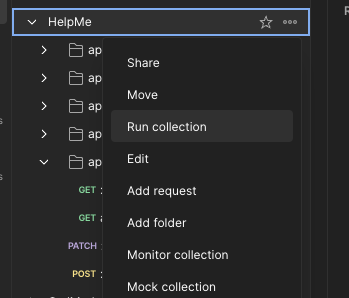

# API Performance

This documentation provides the historical performance of Backend API and steps to reproduce the testing.

## Overview

In the past, we have completed an audit of API endpoints to understand the most used and resource-consuming endpoints that may impact the API performance when the system experiences a large load.

To accomplish this goal, we had to go to the backend code, look into each controller, and understand how each endpoint works. This involved looking at the unit and integration tests, going into production, checking the network tab to see what requests go to the backend for each frontend page, and looking at the frontend code.

### Results

After auditing all the endpoints, we used Postman and its tool to mock the spike in traffic to the backend endpoints (see [Steps to reproduce](#steps-to-reproduce) guide).

On the initial audit, we have produced the following results provided in the following files:

- [Initial Results with High Throughput traffic at the beginning of the test](./files/HelpMe_performance_report_initial_high_throughput_beginning.pdf)
- [Initial Results with High Throughput traffic overtime](./files/HelpMe_performance_report_initial_high_throughput_overtime.pdf)
- [Initial Results with High Throughput traffic for the duration of the test](./files/HelpMe_performance_report_initial_high_throughput.pdf)

The results of these tests indicated that we can handle ~100 requests/second with a minimal response time. However, we have noticed that the larger the database grows, the worse performance is getting. In other words, some of our endpoints did not restrict how many results it should return or store. For instance, if the queue with questions grows to > ~500 records, this will drastically lower the API endpoint's performance and most likely crash the application due to the amount of data it needs to return with the rate of 100 requests / second.

To address this issue, we have restricted the number of questions, question types, and semesters that can exist in the system in this [Pull Request](https://github.com/ubco-db/helpme/commit/79eb7794b54874b9681e190af016f1c4797f18a8).

With this change, we reran the tests:

- [System configuration limits PR with high throughput traffic](./files/HelpMe_performance_report_system_configuration_limits_high_throughput.pdf)
- [System configuration limits PR with medium throughput traffic](./files/HelpMe_performance_report_system_configuration_limits_medium_throughput.pdf)

As a result, with high throughput traffic, we were able to handle ~160 requests / second and a larger number of virtual users (previously, the application crashed if the database had too many records).

In the last iteration, we [introduced Redis caching](https://github.com/ubco-db/helpme/commit/4f0b72a56870d999a862c32cceee7504ae948345) to our highly used API endpoints. Initial results in production showed that our API response time is < 200 ms compared to 400-800 ms when running a load test with Postman. However, this improvement is not evident as we did not rerun the test once we had made these changes.

### Steps to reproduce

1. Download [Postman](https://www.postman.com/downloads/)
2. Import configuration [Profile](./postman/HelpMe.postman_collection.json) to Postman by [following these steps](https://learning.postman.com/docs/designing-and-developing-your-api/importing-an-api/)
3. Add a new environment (can be named as you want). Add an environment called "host" and set the value to `http://localhost:3002/api/v1/`.
4. Start the backend application by running:

```sh
cd packages/server && yarn dev
```

5. Right click on your collection (should be HelpMe) and select "Run Collection"



6. In the new opened tab, ensure all endpoints are selected and tab "Performance" is selected


7. Adjust "Load profile," "Virtual Users," and "Test duration" based on your needs and hit the button "Run"
